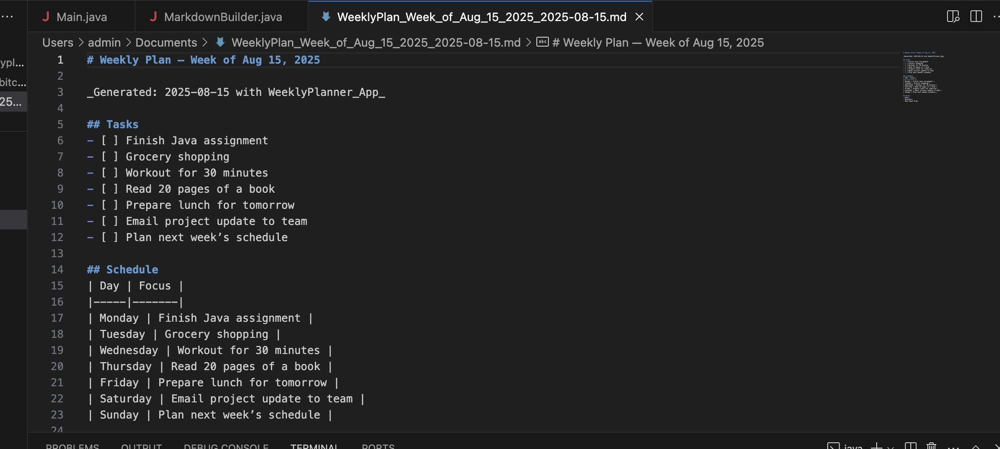

# WeeklyPlanner_App

A simple Java desktop app to create a weekly plan in Markdown format.

## Features

- Enter 3–7 tasks for the week
- Automatically generates a Markdown file
- Saved in your Documents folder
- Optionally opens the file automatically
- Copies file path to clipboard

## How to Use

1. Compile the app:
   ```bash
   javac -d bin src/com/Wubitcode/weeklyplanner/*.java

